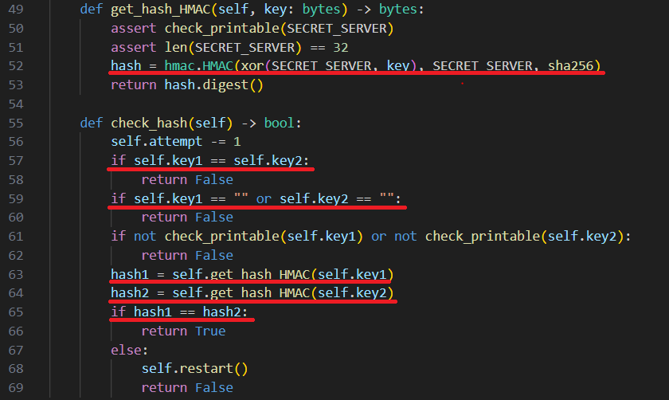

# Сундук с сокровищами

|   Cобытие   | Название | Категория | Сложность |
| :---------: | :------: | :-------: | :-------: |
| Student CTF 2024 |  Сундук с сокровищами  |  Crypto  |  Easy  |

## Описание

>
>Путешествуя по старым каналам города Санкт-Петербурга, вы вдруг натыкаетесь на сундук..., который выглядит достаточно современно, что довольно странно. Осматривая его, вы также не находите никакой замочной скважины, зато находите QR-код.

## Решение

Считываем QR-код и находим ссылку на тг-бота. 
Фнкционал тг-бота достаточно простой, нам прямо в сообщении пишут, что от нас хотят, чтобы получить флаг, далее предлагают сгенерировать key1 и ввести key2, далее что-то вычисляется и нам возвращается сообщение об ошибке и уменьшении попыток. 

Изучая исходный код натыкаемся на самую важную часть таска: 



Нам надо выполнить условия, которые на первый взгляд кажутся нереальными:

- key1 не равен key2;

- оба ключа не могут быть пустыми;

- их хэши, взятые при помощи HMAC с sha256, от серверного секретного ключа должны быть одинаковыми.

Для начала выясним интересную особенность в алгоритме HMAC, когда напишем примерно такой код:

```python
key = b"A"*32
message = b"B"*16
hash1 = hmac.HMAC(key, message, sha256).digest()
hash2 = hmac.HMAC(key + b"\x00", message, sha256).digest()
print(hash1 == hash2)
```

Мы увидим, что print вернет нам True, то есть это та самая типа "коллизия", ключи разные, но хэши одинаковы. Также интересно, что нулевых байт может быть сколько угодно в конце, на результат это не повлияет.

Но решить таск нам по-прежнему мешает незнание серверного ключа, но тут воспользуемся особенностью функции xor из pwntools, так как она выравнивает длины двух строк, которые ей подаются на вход, путем циклического повторения строки меньшей длины. То есть при подаче key1+"A" результат будет: xor(key1+"A", SECRET_SERVER + SECRET_SERVER[0]) = строка длины 33 байта. 

Итоговый план решения: забрутить первую букву SECRET_SERVER и ввести key2 = key1 + SECRET_SERVER[0], чтобы в результате операции xor получить в конце нулевой байт.

В этом нам поможет либо дружная команда, каждый человек которой возьмет себе часть алфавита, в котором всего 63 символа, и попробует вручную, либо библиотека в Python под названием [pyrogram](https://docs.pyrogram.org/), которая поможет автоматизировать взаимодействие с тг-ботом и перебрать символы алфавита.

Решение представлено на языке [Python](sploit.py).

### Флаг

```
stctf{7h3r3_1s_n0_b3tt3r_7re4$ure_th4n_4_fl4g}
```