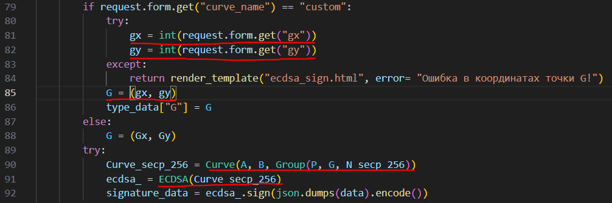
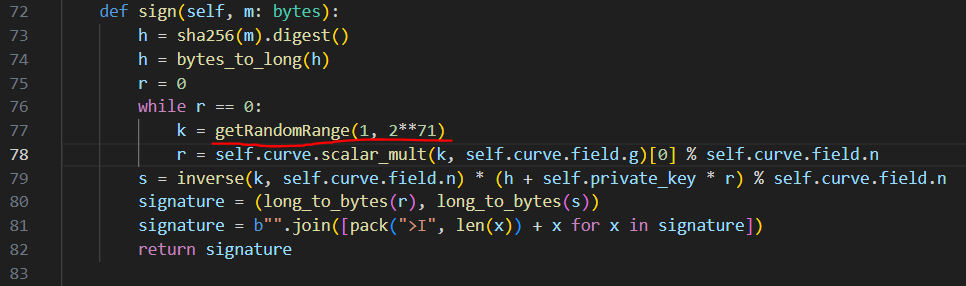
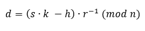

 Мавриинский театр

|   Cобытие   | Название | Категория | Сложность |
| :---------: | :------: | :-------: | :-------: |
| Student CTF 2024 |  Мавриинский театр  |  Crypto |  Hard  |

## Описание

>
>Скоро в Санкт-Петербурге должен открыться Мавриинский театр или театр для программистов. Пока не совсем ясно, причем тут программисты, то ли на представлениях люди будут исполнять строки кода вместо предложений, то ли играть в них будут программисты?! ... Но это все не важно пока что, предлагаем вашему вниманию их (тестовый сайт)[http://85.143.206.150:13339/]. Надеюсь, что там ничего не забыли добавить...


## Решение

Ознакамливаемся с функционалом веб-сервиса, можно зарегистрироваться, усилить подпись с ECDSA, попытаться зайти во вкладку VIP, в которую нас не пустит. После изучаем исходный код, выясняем, что флаг действительно дадут на вкладке VIP при правильной подписи нагрузки в cookie и с полем is_vip: True в ней. Цель ясна, теперь осталось найти, как подделать подпись.

Вначале можно обратить внимание на DSA на основе RSA, можно найти модуль, так как нагрузка известна, её можно менять, подавая разные имена пользователей, но зачем искать модуль? Модуль RSA окажется неуязвимым, а его множители по 1024 бит, поэтому переключаем внимание на ECDSA.

Особенно интересно, что есть отдельная вкладка и функционал по формированию подписи ECDSA, можно даже ввести свою базовую точку. Вот тут и кроется уязвимость:



Оказывается, в системе нигде не проверяется, принадлежит ли введенная точка данной ЭК или нет. Это открывает возможность для проведения атаки под названием "Invalid Curve Point Attack", обычно её связывают с протоколом Диффи-Хеллмана на ЭК, но для ECDSA эта атака также пригодна.

Также указано, что общий секрет сервиса d используется для подписи с выбранной нами базовой точкой. Но проблема в том, что проверка подписи происходит с базовой точкой кривой P-256, что означает, что необходимо восстановить полностью d.

Прежде разберем основу атаки Invalid Curve Point Attack. Из-за того,что в формулах сложения точек не участвует параметр b:

Становится возможным сложить точки, которые не относятся к одной ЭК и имеют совершенно другой порядок.
Таким образом, сгенерируем кривую, перебирая параметр b:


Подадим на вход сервису точку G, принадлежащую кривой .

Также в исходном коде обратим внимание на еще один момент:



k генерируется от 1 до 2^71. Учтем и тот момент, что нам не дана результирующая точка, дана лишь координата x, значит мы имеем две точки Q(x, y) и Q1(x, -y), для которых необходимо решить задачу дискретного логарифмирования на ЭК. Также это означает, что необходимо найти такую точку G, для которой q2 > 2^71. Не забываем, что порядок q2 новой точки уязвим для алгоритма Полига-Хеллмана, поэтому ECDLP спокойно решается через sagemath.

После решения задачи дискретного логарифмирования получим два значения k и k1, которые по очереди необходимо будет подставить в уравнение вычисления s для подписи, выразив d:



После вычисляем две новые подписи и пробуем их для новой нагрузки, в которой поле is_vip = True, и получаем в одном из ответов сервера флаг.


Решение представлено на языке [Python](sploit.py) с использованием библиотеки sagemath.

### Флаг

```
stctf{R3m3mb3R_t0_4lw4y$_cH3ck_7h3_p01nts_f0r_EC_aFf1l14ti0n!}
```