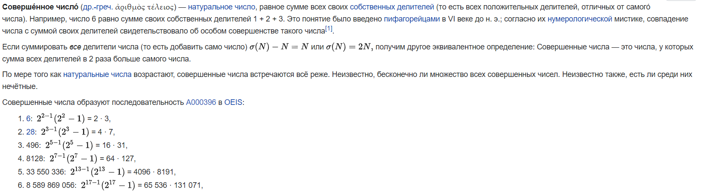
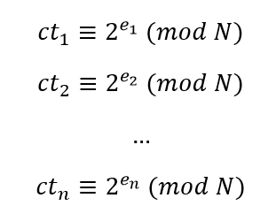
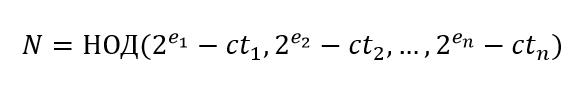
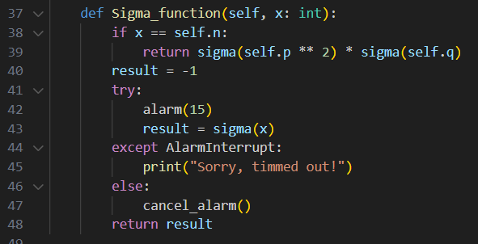
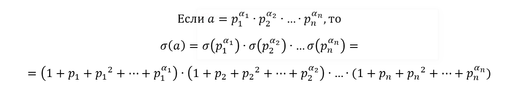
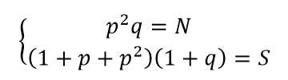
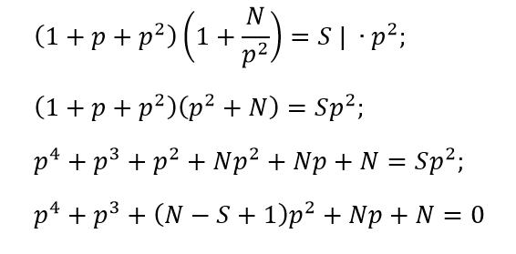

# Совершенный мир 

|   Cобытие   | Название | Категория | Сложность |
| :---------: | :------: | :-------: | :-------: |
| Student CTF 2024 |  Совершенный мир   |  Crypto  |  Medium  |

## Описание

>
>Немного истории: известный и великий математик Леонард Эйлер внёс существенный вклад в становление российской науки и проработал в Санкт-Петербурге в местной Академии наук с 1727г. по 1741г. Одно из его исследований касалось неких совершенных чисел, что же это за такие числа? Пока вы думаете, хотим вас пригласить в наш "Совершенный мир", если вы сможете, конечно, в него попасть:

>**nc 85.143.206.150 13337**

## Решение

Подключаемся к nc-сервису, обнаруживаем, что от нас прежде хотят получить какое-то совершенное число, ещё и определенной битности. Что ж выясняем что это вообще за числа, так как в коде толковых пояснений не найдется, будет лишь использование какой-то функции sigma из sagemath.

Собственно в самой вики есть простое пояснение и даже сами числа приведены:



Также нам нужно либо генерировать совершенное число, либо сохранить их список в массив, так как каждый раз при запуске сервиса битность меняется. Генерировать их достаточно легко, так как всего лишь нужно найти все простые числа Мерсенна до  128 бит и на основе них получать совершенное число. 

После ввода совершенного числа функционал сервиса будет таков:

- получить флаг, зашифрованный на RSA, при том сам модуль N неизвестен, но зафиксирован, а e = 65537;

- получить Sigma от любого числа (пока непонятно зачем это нужно);

- зашифровать сообщение, поданное в hex-формате, на RSA притом с рандомной экспонентой.

Первое, что нам мешает предпринять что-либо - это незнание N. По сути для нахождения флага надо взломать классический RSA, но без модуля мы этого не сделаем.

Для нахождения N будем использовать функционал по шифрованию сообщений с рандомной экспонентой, причем на самом деле здесь как минимум 2 пути рещения:

1. Через gmpy2.mpz, библиотека, которая в Python позволяет работать с очень и очень большими числами, чтобы возвести хотя бы 2 в очень большую степень без проблем. Если 

    

    то тогда для нахождения N необходимо:

    

    При этом экспоненты должны быть разными и чем больше примеров, тем точнее получится N. Как раз для вычисления 2 в большой степени и понадобится gmpy2.mpz.

2. Через интересную особенность, оставленную в коде:

    

    Если подумать, то 0 никак нельзя получить при возведении в степень по модулю N, если мы не ввели само N или 0. То есть это позволяет провести бинарный поиск и вычислить N. 
    
    Мы обозначаем за нижнюю границу low = 2^1534, а верхняя high = 2^1536 и подаем число mid = (low + high) // 2.

    Если нам вернулся 0, то теперь high = mid, а low остается неизменной, и пересчитываем mid = (low + high) // 2, если же нам вернулся не 0, значит low = mid, high неизменна, а mid = (low + high) // 2. 
    
    Такими нехитрыми действиями всего за чуть больше 1500 шагов подберем N

Теперь пора приступить ко второму этапу решения. Имея N нужно найти способ его факторизовать, важно, что N = p^2 * q. У нас остается незадействованным функционал по вычислению Sigma для почти любого числа, так как в коде стоит ограничение по времени вычисления этой функции:



А самым важным будет то, что в коде прям прописано возможность вычислить Sigma(N), теперь настало пора разобраться, что из себя представляет Sigma:



Из этого делаем вывод, что 


Составляем систему уравнений:



Решить её будет нетрудно, для начала выразим q из первого уравнения и подставим во второе, потом раскроем скобки и получим уравнение 4 степени:



Такое уравнение Sagemath решит на раз-два, поэтому ему и скармливаем и гарантировано получим один целый корень, который и будет p, находим q, а дальше по классике расшифровываем наш флаг.

Решение представлено на языке [Python](sploit.py) с использованием библиотеки sagemath.

### Флаг

```
stctf{RS4_1$_br0k3n_us1ng_7he_$igm4_funct10n}
```