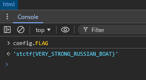

# Boat

|   Cобытие   | Название | Категория | Сложность |
| :---------: | :------: | :-------: | :-------: |
| Student CTF 2024 |   Ботик Петра   |  Misc  |  Easy  |

## Описание

>Ботик был обнаружен 16-летним Петром в 1688 г. в царском селе Измайловском под Москвой, Тогда же родилась версия о его английском происхождении, не доказанная и не опровергнутая до сих пор. Петр I, плавая на ботике по Просяному пруду и реке Яуза, учился хождению под парусами. Белеет парус одинокий ...

## Решение

Поскольку приложение у нас клиентское, можно получить доступ к js. Видим, что js обфусцирован и используем деобфускатор. (ex: 
obf-io.deobfuscate.io)


Видим, что при достижении более 31337 очков вылетает флаг, но зачем ждать? Вызовем его сами сразу!


### Флаг

```
stctf{VERY_STRONG_RUSSIAN_BOAT}
```
