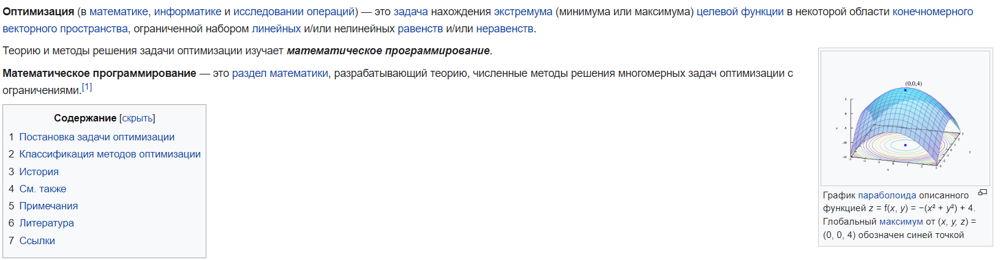

 Оптимизация, оптимизация и еще раз оптимизация...

|   Cобытие   | Название | Категория | Сложность |
| :---------: | :------: | :-------: | :-------: |
| Student CTF 2024 |  Оптимизация, оптимизация и еще раз оптимизация...  |  Misc |  Medium  |

## Описание

>
>Когда-то давно меня попросили кое-что оптимизировать... Ох, это оказалось так непросто... Я оптимизировал, оптимизировал, оптимизировал, но так и не смог оптимизировать до конца... Может, вы сможете мне помочь?

>**nc 85.143.206.150 13338**

>P.S.: иногда очень непросто бывает оптимизировать... не бойтесь долгих загрузок... Удачи!

## Решение

Подключаемся к сервису, нам предлагают решить каких-то 16 задач и появляется условие одной из таких. Во-первых, все-таки надо разобраться, что это за такие "задачи оптимизации". Лезем в гугл, на первых же ссылках будет лежать ответ:



Можно поподключаться несколько раз и собрать разные условия нескольких типов таких задач. Можно будет заметить, что везде в условиях только первая степень у xi. Делаем вывод, что имеем дело с задачами либо "Линейного программирования", либо "Целочисленного программирования", так как в некоторых задачах пишут "Find an integer solution".

Далее стоит поискать побольше информации и выяснить, что имеем дело с 4 типами задач:

1. Обычная задача линейного программирования, где есть n переменных и k условий для них.

2. Обычная задача целочисленного линейного программирования, где есть n переменных и k условий для них.

3. Транспортная задача об оптимизации поставок.

4. Задаче об укладке рюкзака, в которой xi принимают либо 0, либо 1 и всего одно условие.

Примеры решения каждого типа задач легко найти, в данном случае в решении использовалась либа scipy для Python3.

Далее дело техники:

1. Определить тип задачи.

2. Распарсить условия задачи.

3. Решить задачу.

Таск представляет собой классический таск на PPC. Решение представлено на [Python](sploit.py) с использованием библиотеки scipy.

### Флаг

```
stctf{V4r1ous_L1n3aR_pr0gr4mmiNg_pr0blem$_are_very_34sy_r1ght?}
```