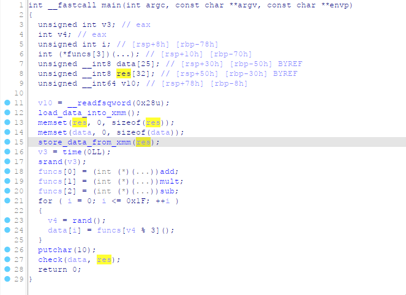
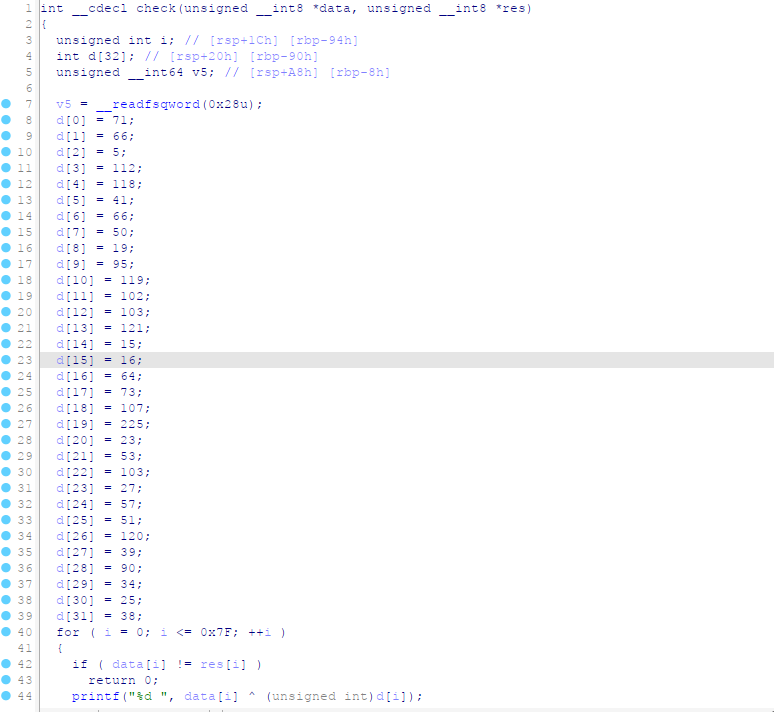

# Time Machine

|   Cобытие   | Название | Категория | Сложность |
| :---------: | :------: | :-------: | :-------: |
| Student CTF 2024 |  Машина времени  |  Reverse  |  Easy  |

## Описание

>Наши учёные изобрели уникальную машину времени, позволявшую путешествовать в прошлое. Однако эта машина требует ввода специальных кодов, чтобы перемещаться в разные временные периоды и места. Одним из самых популярных направлений для путешествий стало посещение Санкт-Петербурга в разные эпохи его существования, чтобы своими глазами увидеть эволюцию его архитектуры. Только вот коды куда-то пропали! Должны же быть прямо под носом...

## Решение

Открываем IDA Pro 



### Логика программы следующая: 

Изначально, с помощью секции .mydata в массив res подгружаются некоторые данные.

У программы есть массив функций funcs[3], в который помещены функции сложения, умножения и вычитания. Функции вызываются случайным образом, а результат их выполнения помещается в массив data[25]. 

Массив res, в свою очереь, содержит правильные ответы, которые нам необходимо получить. Например, res[0] == 52, вызвана функция mult, тогда нам необходимо ввести числа 26 и 2, например, чтобы получить 52. Просмотреть массив res мы можем либо через секцию .mydata, либо с помощью динамического анализа и установки точки останова. 

Затем вызывается функция check, которая как раз проверяет правильность введённых данных с массивом res. 

В случае если массивы совпадают, происходит XOR введённых данных и массива d[32].

### Флаг

```
stctf{n0w_y0u_c4n_s33_m3}
```