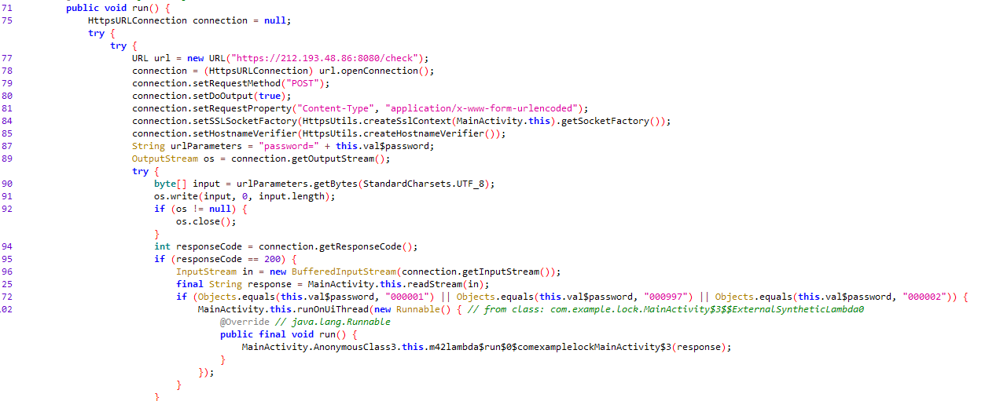
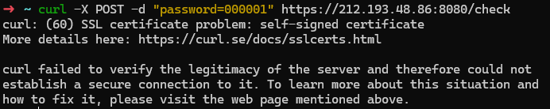
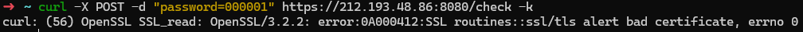
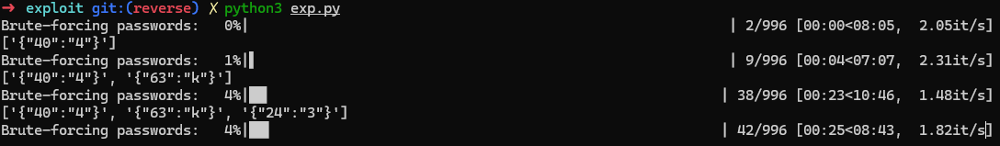

# Экскурсия


|  Cобытие  |  Название  | Категория | Сложность |
| :--------------: | :----------------: | :----------------: | :----------------: |
| Student CTF 2024 | Экскурсия |      Reverse      |        Hard        |

## Описание

> Пошли мы на экскурсию в русский музей, а там, представляешь, нововведения! Вход не по билетам, а по каким-то кодам! Всё утро решал, так и не смог. Помоги, пожалуйста, и вместе на Айвазовского сходим!

## Решение

### Для начала откроем APK в JADX-GUI:



Замечаем, что пароль, который, который мы вводим отправляется на сервер HTTPS. Попробуем отправить запрос самостоятельно:



Прочитав статью на curl.se добавим флаг -k:



Снова же ошибка о неверных сертификатах. Попробуем их достать.

### Распакуем приложение с помощью APKTool

Сертификаты, обычно, лежат по пути res/raw/<cert_name>.<_extension_>. Так и есть, находим файл:

Анализируя логику приложения догадываемся, что речь идёт о подборе пароля, путём отправки паролей от **000001** до **000997**.  Можно попробовать запроксироваться через Proxyman/Burp/Charles, но кажется, что можно сделать это проще 1 скриптом. Поскольку сертификаты у нас есть приступим к написанию скрипта:

Перед этим необходимо знать пароль от сертификата. Его мы можем найти в файле HttpsUtils: 
```java
        try {
            keyStore.load(keyStoreStream, "exportpassword".toCharArray());
            if (keyStoreStream != null) {
                keyStoreStream.close();
            }
```


### Скрипт

```python
import warnings
from requests.packages.urllib3.exceptions import InsecureRequestWarning
import requests
from cryptography.hazmat.primitives import serialization
from cryptography.hazmat.primitives.serialization import pkcs12
from cryptography.hazmat.primitives.serialization import (
    Encoding,
    PrivateFormat,
    NoEncryption,
)
from tqdm import tqdm
import json

warnings.simplefilter("ignore", InsecureRequestWarning)

# Отправка запроса на сервер с использованием сертификатов
def send_request(password, cert_file, key_file):
    try:
        response = requests.post(
            "https://212.193.48.86:8080/check",
            data={"password": password},
            cert=(cert_file, key_file),
            verify=False,  # Отключаем проверку подлинности сертификата
        )
        return response
    except requests.exceptions.SSLError as e:
        print(f"SSL Error: {e}")
    except requests.exceptions.RequestException as e:
        print(f"Request Error: {e}")
    return None


def brute_force_passwords(password_list, cert_file, key_file):
    """Функция для подбора пароля и составления общего списка паролей"""
    response_list = []
    for password in tqdm(password_list, desc="Brute-forcing passwords"):
        response = send_request(password, cert_file, key_file)
        if response and response.status_code == 200:
            response_list.append(response.text.replace('\n', ''))
            print(response_list)

# Укажим путь и пароль(можем найти его в HttpsUtils в JADX)
p12_file_path = "keystore_new.p12"
p12_password = b"exportpassword"
# Распакуем сертификат
with open(p12_file_path, "rb") as f:
    p12_data = f.read()

private_key, certificate, additional_certs = pkcs12.load_key_and_certificates(
    p12_data, p12_password
)

with open("cert.pem", "wb") as cert_file:
    cert_file.write(certificate.public_bytes(Encoding.PEM))

with open("key.pem", "wb") as key_file:
    key_file.write(
        private_key.private_bytes(
            encoding=Encoding.PEM,
            format=PrivateFormat.PKCS8,
            encryption_algorithm=NoEncryption(),
        )
    )

with open("ca.pem", "wb") as ca_file:
    for ca_cert in additional_certs:
        ca_file.write(ca_cert.public_bytes(Encoding.PEM))

# Составим список паролей
password_list = [str(i).zfill(6) for i in range(3, 999)]
# Запустим наш брутфорс
brute_force_passwords(password_list, "cert.pem", "key.pem")

```



Результатом работы скрипта станет список словарей:

```
[{"40":"4"}, {"63":"k"}, {"24":"3"}, {"30":"R"}, {"87":"n"}, {"81":"j"}, {"92":"j"}, {"68":"z"}, {"85":"g"}, {"77":"f"}, {"2":"c"}, {"47":"_"}, {"94":"d"}, {"90":"p"}, {"32":"S"}, {"99":"}"}, {"25":"_"}, {"73":"c"}, {"12":"_"}, {"83":"g"}, {"1":"t"}, {"84":"n"}, {"72":"p"}, {"37":"G"}, {"5":"{"}, {"66":"n"}, {"38":"_"}, {"65":"y"}, {"76":"k"}, {"43":"W"}, {"51":"h"}, {"33":"t"}, {"74":"x"}, {"41":"5"}, {"88":"w"}, {"70":"k"}, {"46":"D"}, {"39":"P"}, {"98":"a"}, {"93":"p"}, {"50":"f"}, {"10":"s"}, {"97":"c"}, {"9":"u"}, {"62":"n"}, {"4":"f"}, {"49":"r"}, {"14":"4"}, {"28":"p"}, {"53":"m"}, {"18":"T"}, {"31":"_"}, {"80":"h"}, {"17":"_"}, {"79":"l"}, {"11":"T"}, {"44":"O"}, {"13":"W"}, {"82":"v"}, {"23":"k"}, {"60":"t"}, {"16":"T"}, {"34":"r"}, {"54":"g"}, {"71":"u"}, {"35":"0"}, {"55":"x"}, {"48":"d"}, {"86":"p"}, {"36":"n"}, {"52":"a"}, {"29":"3"}, {"89":"r"}, {"61":"j"}, {"64":"n"}, {"56":"j"}, {"19":"o"}, {"21":"m"}, {"78":"i"}, {"42":"5"}, {"20":"_"}, {"95":"v"}, {"67":"c"}, {"3":"t"}, {"58":"v"}, {"96":"m"}, {"7":"_"}, {"57":"f"}, {"27":"U"}, {"45":"r"}, {"26":"s"}, {"8":"j"}, {"15":"n"}, {"69":"y"}, {"91":"h"}, {"59":"l"}, {"6":"i"}, {"0":"s"}, {"22":"4"}, {"75":"t"}, ]
```

Которые нам нужно отсортировать методом естественной сортировки:

```python
import re

def natural_key(key):

    return [
        int(text) if text.isdigit() else text.lower()
        for text in re.split("([0-9]+)", key)
    ]

def sort_natural(data):
    items = [(list(d.keys())[0], list(d.values())[0]) for d in data]

    sorted_items = sorted(items, key=lambda item: natural_key(item[0]))
    sorted_data = [{k: v} for k, v in sorted_items]

    return sorted_data

data = [{"40":"4"}, {"63":"k"}, {"24":"3"}, {"30":"R"}, {"87":"n"}, {"81":"j"}, {"92":"j"}, {"68":"z"}, {"85":"g"}, {"77":"f"}, {"2":"c"}, {"47":"_"}, {"94":"d"}, {"90":"p"}, {"32":"S"}, {"99":"}"}, {"25":"_"}, {"73":"c"}, {"12":"_"}, {"83":"g"}, {"1":"t"}, {"84":"n"}, {"72":"p"}, {"37":"G"}, {"5":"{"}, {"66":"n"}, {"38":"_"}, {"65":"y"}, {"76":"k"}, {"43":"W"}, {"51":"h"}, {"33":"t"}, {"74":"x"}, {"41":"5"}, {"88":"w"}, {"70":"k"}, {"46":"D"}, {"39":"P"}, {"98":"a"}, {"93":"p"}, {"50":"f"}, {"10":"s"}, {"97":"c"}, {"9":"u"}, {"62":"n"}, {"4":"f"}, {"49":"r"}, {"14":"4"}, {"28":"p"}, {"53":"m"}, {"18":"T"}, {"31":"_"}, {"80":"h"}, {"17":"_"}, {"79":"l"}, {"11":"T"}, {"44":"O"}, {"13":"W"}, {"82":"v"}, {"23":"k"}, {"60":"t"}, {"16":"T"}, {"34":"r"}, {"54":"g"}, {"71":"u"}, {"35":"0"}, {"55":"x"}, {"48":"d"}, {"86":"p"}, {"36":"n"}, {"52":"a"}, {"29":"3"}, {"89":"r"}, {"61":"j"}, {"64":"n"}, {"56":"j"}, {"19":"o"}, {"21":"m"}, {"78":"i"}, {"42":"5"}, {"20":"_"}, {"95":"v"}, {"67":"c"}, {"3":"t"}, {"58":"v"}, {"96":"m"}, {"7":"_"}, {"57":"f"}, {"27":"U"}, {"45":"r"}, {"26":"s"}, {"8":"j"}, {"15":"n"}, {"69":"y"}, {"91":"h"}, {"59":"l"}, {"6":"i"}, {"0":"s"}, {"22":"4"}, {"75":"t"}, ]

sorted_data = sort_natural(data)
for item in sorted_data:
    print(list(item.values())[0], end='')

```

###

Флаг

```
stctf{i_jusT_W4nT_To_m4k3_sUp3R_Str0nG_P455WOrD_drfhamgxjfvltjnknynczykupcxtkfilhjvgngpnwrphjpdvmca}
```
