# Broken Matryoshka


|  Cобытие  | Название | Категория | Сложность |
| :--------------: | :---------------: | :----------------: | :----------------: |
| Student CTF 2024 |  Поломанная матрёшка |      Reverse      |       Medium       |

## Описание

> Oh, my friend, мы же в России! А что за сувениры тут есть? Ну, Of course, darling! Russian Matryoshka! Только вот при доставке повредилась a little bit. But... nevermind, так даже лучше!

## Решение

### 1. Воспользуемся утилитой Detect It Easy, чтобы понять, с чем мы имеем дело:

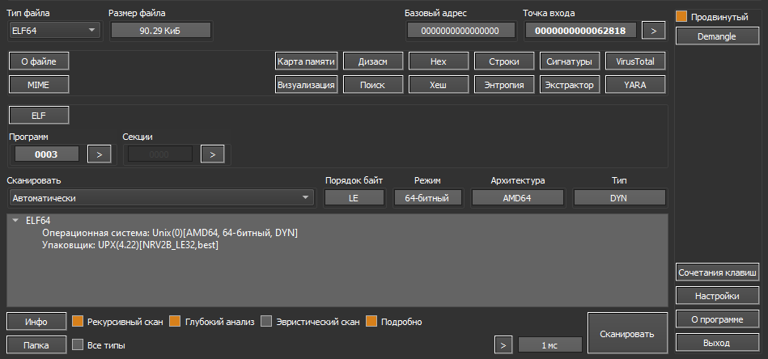

Исполняемый файл Linux, упакованный UPX.

### 2. Пробуем открыть в IDA Pro

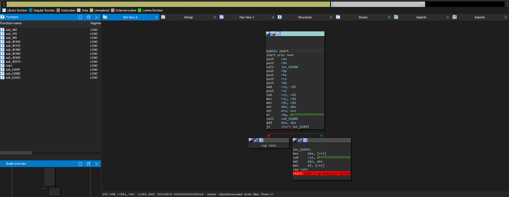

Как можем заметить, интересного мало. Необходимо снимать UPX:

### 3. Воспользуемся командой: ```upx -d task```

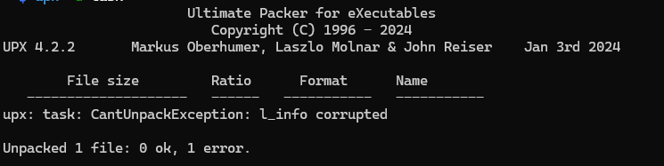

Информация для распаковки повреждена.

### 4. Попробуем заглянуть что внутри с помощью hex-редактора:

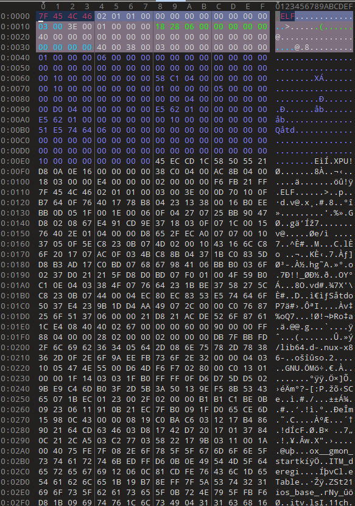

На первый взгялд всё хорошо, но приложение не распаковывается. UPX хранит данные для распаковки в начале файла и в конце:

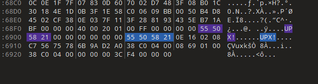

### 5. Попробуем создать наш файл и упаковать его таким же UPX:

```c++
#include <iostream>

using namespace std;

int main() {
	cout<<"hello world!"<<endl;
}
```

Компилируем: ```g++ test.cpp -o test```

Упаковываем: ```upx ./test```

Откроем в hex-редакторе и сравним:

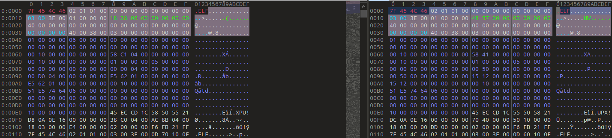

Видим, что вместо правильного **UPX!** у нас написано **XPU!**. Поменяем обратно!

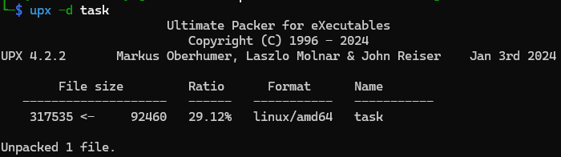

### 6. Снова откроем IDA PRO:

И увидим следующий псевдокод:


Скопируем данные из переменных в файл(я для этого использую плагин [hexcopy от OALabs](https://github.com/OALabs/hexcopy-ida).

### 7. Получаем 3 файла:

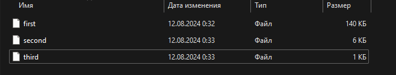

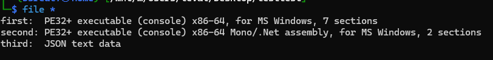

### 8. Переименуем их:

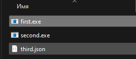

По json и команде file понимаем, что дело идет с .NET, попробуем запустить first.exe:

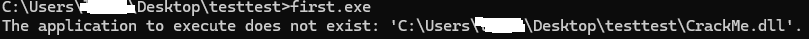

Отлично, файл просит библиотеку CrackMe.dll, наверняка 2 файл и есть библиотека. Снова переименуем файлы:

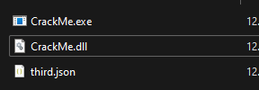

И попробуем запустить:

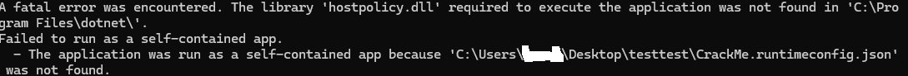

А вот и информация о нашем третьем файле! Снова переименуем и запустим.

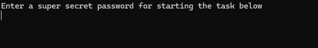

### 9. Откроем dll в ILSpy:

Для начала посмотрим в ветку Program:

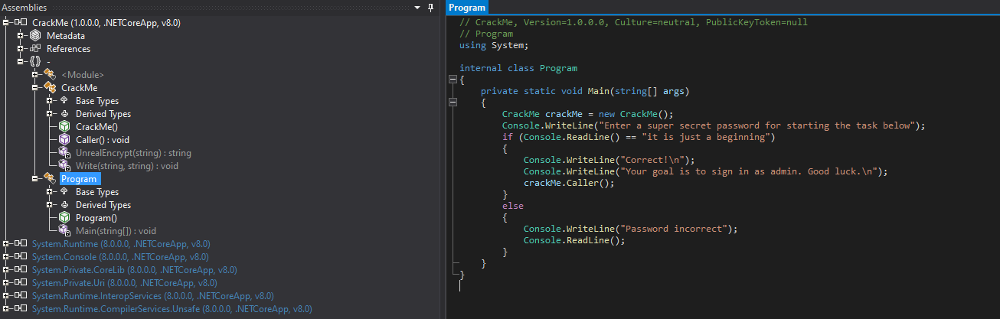

Пароль на первую стадию - ```it is just a beginning```. Вводим и переходим ко второму этапу.

### 10. Переходим к ветке CrackMe:

Самое сложное в этом крякми - функция **UnrealEncrypt(string)**. Однако суть её проста и заключается в обычной замене букв английской раскладки русскими.

Таким образом:

* Логин - ```hbr_'cnkb```
* Пароль - ```nevergonnamakeyoucry```

## Флаг

```
stctf{hbr_'cnkb_nevergonnamakeyoucry}
```
